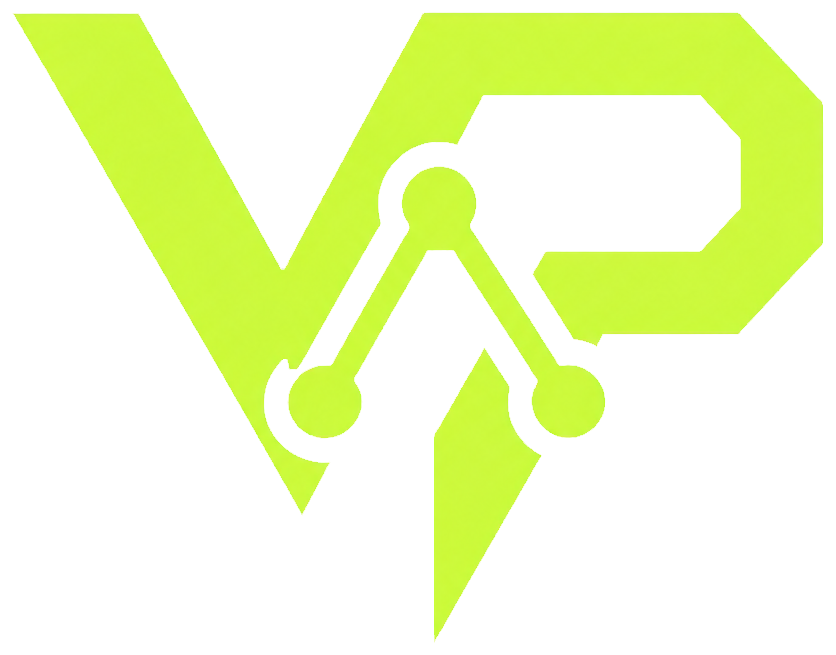
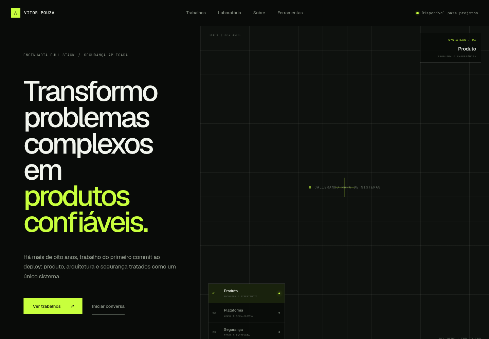
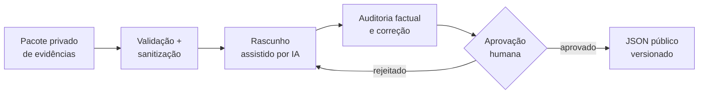
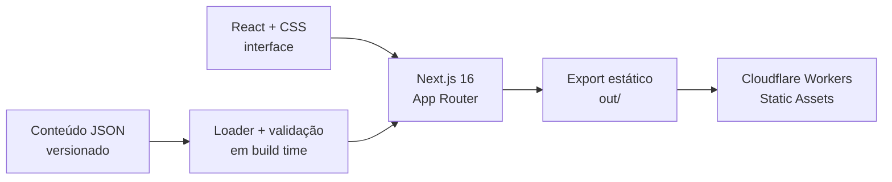

<p align="center">
  <a href="https://vitorpouza-dev.vhnpouza.workers.dev">
    
  </a>
</p>

<h1 align="center">Portfolio Experience</h1>

<p align="center">
  <strong>Produto, plataforma e segurança — do problema à produção.</strong><br />
  Um portfólio público desenhado como sistema inspecionável: decisões, provas e limites no lugar de adjetivos.
</p>

<p align="center">
  <a href="https://github.com/vtrpza/portfolio-experience/actions/workflows/quality.yml"></a>
  <a href="https://nextjs.org/"></a>
  <a href="https://react.dev/"></a>
  <a href="https://www.typescriptlang.org/"></a>
  <a href="https://developers.cloudflare.com/workers/"></a>
</p>

<p align="center">
  <a href="https://vitorpouza-dev.vhnpouza.workers.dev"><strong>Explorar o site ↗</strong></a>
  &nbsp;·&nbsp;
  <a href="https://vitorpouza-dev.vhnpouza.workers.dev/case-studies/">Ver trabalhos</a>
  &nbsp;·&nbsp;
  <a href="https://vitorpouza-dev.vhnpouza.workers.dev/artigos/">Ler artigos</a>
</p>

<p align="center">
  <a href="https://vitorpouza-dev.vhnpouza.workers.dev">
    
  </a>
</p>

## Não é só uma landing page

Este repositório reúne o portfólio público de **Vitor Pouza**, engenheiro full-stack com mais de oito anos de experiência. A experiência foi construída para responder quatro perguntas sem depender de discurso promocional:

1. Qual era o problema?
2. Qual decisão foi tomada?
3. Que evidência sustenta o trabalho?
4. Onde termina o alcance da conclusão?

A home transforma essas perguntas em um observatório interativo de três camadas. O restante do site aprofunda projetos, trajetória, experimentos e decisões técnicas com conteúdo semântico, navegável e versionado.

## Um sistema, três camadas

| Camada | Projeto | O que pode ser inspecionado |
| --- | --- | --- |
| **01 · Produto** | [Repo Pulse](https://github.com/vtrpza/repo-pulse) | Busca e comparação de repositórios GitHub com filtros, sinal comparativo e histórico em D1. |
| **02 · Plataforma** | [Blog VR](https://github.com/vtrpza/blog-vr) | Worker SSR em TypeScript no domínio próprio, com D1, Workflows, quality gates, Turnstile e Pipedrive. |
| **03 · Segurança** | [reconctx](https://github.com/vtrpza/reconctx) | Ferramenta em desenvolvimento para compilar recon limitado em handoffs rastreáveis e verificáveis. |

O efeito tridimensional é feito com **React + CSS**, sem WebGL, Three.js ou uma dependência gráfica pesada. A interface preserva navegação por teclado, foco visível e `prefers-reduced-motion`.

## Evidência antes de adjetivos

- Estudos de caso separam **contexto, decisão, evidência e resultado**.
- Métricas públicas entram apenas com fonte e escopo conhecidos.
- Projetos confidenciais permanecem anonimizados.
- Artigos exibem maturidade, limitações, referências e proveniência.
- IA pode ajudar na redação; publicação exige auditoria factual e aprovação humana explícita.



> **A experiência é a fonte. IA é ferramenta de redação.**

O pipeline usa schemas estritos, allowlist de fontes, bloqueio de material sensível e `store: false` nas chamadas à API. A política completa está em [`/politica-editorial/`](https://vitorpouza-dev.vhnpouza.workers.dev/politica-editorial/).

## O que está publicado

| Rota | Conteúdo |
| --- | --- |
| `/` | Posicionamento, observatório, evidência profissional e trabalho selecionado. |
| `/case-studies/` | Repo Pulse, Blog VR, reconctx e trajetória profissional. |
| `/playground/` | Experimentos em segurança, automação, interfaces e IA. |
| `/artigos/` | Publicações agrupadas por área. |
| `/artigos/[slug]/` | Texto, fontes, limitações e proveniência. |
| `/politica-editorial/` | Critérios de evidência, autoria, IA, privacidade e correções. |
| `/about/` | Trajetória e princípios operacionais. |
| `/uses/` | Ferramentas atuais e as razões de uso. |
| `/workana/` | Apresentação isolada e `noindex`, preparada para impressão em PDF. |

## Arquitetura



```text
src/app/                     páginas, metadata, sitemap e robots
src/components/              navegação, hero, observatório e layout editorial
src/lib/articles.ts          carga e validação dos artigos durante o build
content/articles/            fonte pública e versionada das publicações
content/social/instagram/    pacotes sociais derivados de artigos aprovados
editorial/article.ts         contratos e validações editoriais
scripts/editorial.ts         CLI editorial e integração com a OpenAI
wrangler.jsonc               publicação de out/ como ativos estáticos
```

### Stack

- **Runtime:** Node.js 22
- **Aplicação:** Next.js 16.2, React 19.2 e App Router
- **Linguagem:** TypeScript 5 em modo `strict`
- **Interface:** CSS responsivo e Tailwind CSS 4 via PostCSS
- **Qualidade:** ESLint 9, Vitest 4, Testing Library e jsdom
- **Entrega:** exportação estática e Wrangler 4 para Cloudflare Workers

## Executar localmente

```bash
git clone https://github.com/vtrpza/portfolio-experience.git
cd portfolio-experience
nvm use
npm ci --include=dev
npm run dev
```

Abra [http://localhost:3000](http://localhost:3000).

### Verificar tudo

```bash
npm run lint
npm run typecheck
npm test
npm run build
```

O mesmo conjunto roda em cada push para `main` e em pull requests pelo workflow [`Quality`](.github/workflows/quality.yml).

## Fluxo editorial

Evidências e rascunhos ficam fora do Git. Apenas artigos aprovados e seus derivados públicos entram em `content/`.

```bash
# 1. Validar o pacote local de evidências
npm run editorial -- validate editorial/evidence/exemplo.json

# 2. Carregar a chave sem gravá-la no histórico do shell
read -rsp "OPENAI_API_KEY: " OPENAI_API_KEY && echo
export OPENAI_API_KEY

# 3. Gerar e auditar o rascunho
npm run editorial -- generate editorial/evidence/exemplo.json

# 4. Limpar a chave da sessão
unset OPENAI_API_KEY

# 5. Aprovar o arquivo revisado
npm run editorial -- approve editorial/drafts/slug.json
```

O último comando só publica após a confirmação exata `APROVAR <slug>`. Pacotes para Instagram são gerados a partir de um artigo já aprovado:

```bash
npm run editorial -- social content/articles/slug.json
```

## Deploy

```bash
npx wrangler login
npx wrangler whoami
SITE_ENV=production npm run deploy:dry
SITE_ENV=production npm run deploy
```

`npm run build` gera `out/`; o Wrangler publica esse diretório como ativos estáticos. `SITE_ENV=production` habilita indexação e sitemap no build publicado.

## Princípios do projeto

- Conteúdo continua útil sem depender da camada visual interativa.
- Acessibilidade e movimento reduzido fazem parte da implementação, não do checklist final.
- Cliente, resultado, escala ou depoimento nunca são inventados.
- Segredos, credenciais, tokens, PII e infraestrutura privada não entram no conteúdo público.
- Uma conclusão só pode ser tão ampla quanto a evidência que a sustenta.

---

<p align="center">
  Construído por <a href="https://github.com/vtrpza"><strong>Vitor Pouza</strong></a><br />
  <sub>Engenharia full-stack · produto · segurança aplicada</sub>
</p>
